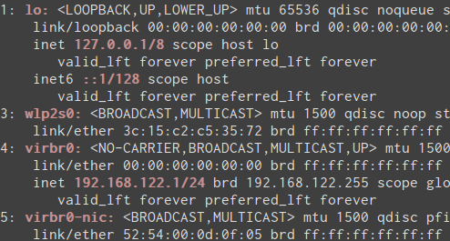

# COLORX
Colorize your standard output using Perl's regular expressions.

    colorx [ -c='color' ] 'regex-1' .. 'regex-n'

## DESCRIPTION

* `-c='bold red'` : Sets default color. For available colors check perldoc Term::ANSIColor.
* `'regex-1' .. 'regex-n'` : Regular expressions to colorize.

## Example

Colorize ip addresses and interface names:

    ip addr | colorx 'inet6? \K\S+' '^\d+:\s\K\S+'
    

